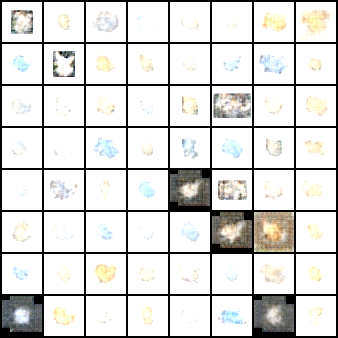
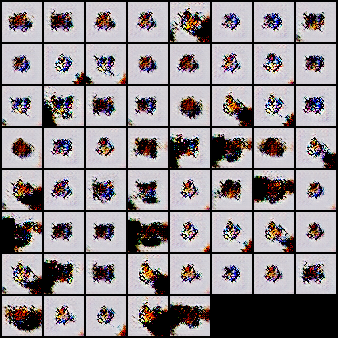

# Reference

## VAE
[pytorch-vae](https://github.com/ethanluoyc/pytorch-vae/blob/master/vae.py)

## Experiment result

## VAE-GAN
[vae-gan](https://github.com/rohithreddy024/VAE-GAN-Pytorch)
### Experiment result

> TODO: Discriminator converged too early and cause the training of Generator to collapse

## NICE
[NICE](https://github.com/DakshIdnani/pytorch-nice)

## Experiment result

